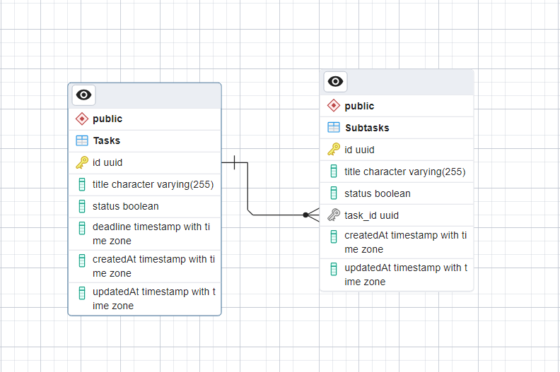

# Todolist API

## Overview

The **Todolist API** is a backend service designed for managing tasks and subtasks efficiently. It includes core features for task management, along with additional functionalities like deadlines and progress tracking for subtasks. The API is built using **Node.js**, **Express.js**, and **Sequelize**, with **PostgreSQL** as the database.

## Entity Relationship Diagram (ERD)



## Features

### Core Features:
1. Add a task.
2. View ongoing task(s).
3. Delete a task.
4. Update/Edit a task.
5. Mark a task as complete (automatically removes it from ongoing tasks).

### Additional Features:
#### A. Deadlines
1. Add a deadline (date and time) to a task.
2. Display an indicator if the task is overdue.

#### B. Subtasks
1. Add subtasks to a task.
2. Edit or delete subtasks.
3. Mark subtasks as complete.
4. Automatically update the main task's status to complete if all subtasks are marked as complete.

#### C. Progress Tracking
- Calculate and display progress status as a percentage for the main task based on the completion of its subtasks.

## Tech Stack

- **Node.js**: Backend runtime environment.
- **Express**: Web framework for building RESTful APIs.
- **Sequelize**: ORM for interacting with the PostgreSQL database.
- **PostgreSQL**: Relational database.
- **dotenv**: Environment variable management.
- **nodemon**: Development tool for automatic server restarts.

## Setup

### Prerequisites

1. Install Node.js
2. Install PostgreSQL

### Environment Variables

Create a `.env` file in the root directory and configure the following:

```env
POSTGRES_URI=your_postgresql_connection_string
PORT=3000
```

### Installation

1. Clone the repository:
   ```bash
   git clone https://github.com/takimsry/todolist-api.git
   cd todolist-api
   ```

2. Install dependencies:
   ```bash
   npm install
   ```

3. Configure environment variables:
   - Create a `.env` file in the root directory and add your PostgreSQL URI:
     ```
     POSTGRES_URI=<your_database_uri>
     PORT=3000
     ```

4. Start the development server:
   ```bash
   npm run dev
   ```
   For production:
   ```bash
   npm start
   ```

## API Documentation

For the full API documentation, please refer to the Postman collections exports available at the following file:

[Postman Collection File](https://github.com/takimsry/todolist-api/tree/master/postman/todolist.postman_collection.json)